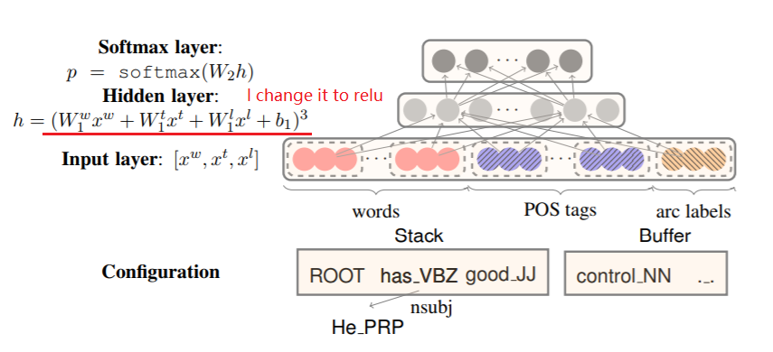
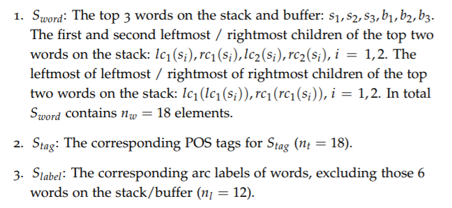

# Dependency Parsing with Pytorch

A trainsition-based dependency parser

## Introduction

A constituency parse tree breaks a text into sub-phrases. Non-terminals in the tree are types of phrases, the terminals are the words in the 
sentence, and the edges are unlabeled. For a simple sentence "John sees Bill", a constituency parse would be:  

                  Sentence  
                     |  
       +-------------+------------+  
       |                          |  
  Noun Phrase                Verb Phrase  
       |                          |  
     John                 +-------+--------+  
                          |                |  
                        Verb          Noun Phrase  
                          |                |  
                        sees              Bill  
A dependency parse connects words according to their relationships. Each vertex in the tree represents a word, child nodes are words that are 
dependent on the parent, and edges are labeled by the relationship. A dependency parse of "John sees Bill", would be:  

              sees  
                |  
        +--------------+  
subject |              | object  
        |              |  
      John            Bill  
You should use the parser type that gets you closest to your goal. If you are interested in sub-phrases within the sentence, you probably want 
the constituency parse. If you are interested in the dependency relationships between words, then you probably want the dependency parse.  

Here I built a dependency parser following Stanford CS224n and Danqi Chen's paper. The structure of the neural network parser is as follow:  
  
The features I used are:  
  

## Methodology

1. Read data from file and get some useful information(eg.vocab size, token to id)
2. Build a neural network model for dependency parsing
3. Prepare the training data (eg. words in the buffer and on the stack, pos tags)
4. Train the model with approporiate learning rate
5. Evluate the model with development data

## Result
Because the dataset is labeled with transitions, so here I use accurarcy to evaluate the model instead of UAS and LAS.  
The model is overfitted on evaluation dataset because I do not try to tune the parameters to maximize the performance on it. It is just a demo. After
35 iterations, the result on trainning dataset is:  
Predicted:  [['SHIFT', 'SHIFT', 'SHIFT', 'SHIFT', 'REDUCE_L', 'REDUCE_L', 'REDUCE_L', 'SHIFT', 'SHIFT', 'REDUCE_L', 'SHIFT', 'SHIFT', 'SHIFT', 'SHIFT', 'REDUCE_L', 'REDUCE_L', 'REDUCE_L', 'SHIFT', 'REDUCE_R', 'REDUCE_R', 'REDUCE_R', 'SHIFT', 'REDUCE_R', 'SHIFT', 'REDUCE_R']]  
Ground Truth:  [['SHIFT', 'SHIFT', 'SHIFT', 'SHIFT', 'REDUCE_L', 'REDUCE_L', 'REDUCE_L', 'SHIFT', 'SHIFT', 'REDUCE_L', 'SHIFT', 'SHIFT', 'SHIFT', 'SHIFT', 'REDUCE_L', 'REDUCE_L', 'REDUCE_L', 'SHIFT', 'REDUCE_R', 'REDUCE_R', 'REDUCE_R', 'SHIFT', 'REDUCE_R', 'SHIFT', 'REDUCE_R']]  
Total loss: 0.28010822834707083, Accuracy: 0.8947368421052632  

## References:
https://github.com/rguthrie3/DeepDependencyParsingProblemSet  
https://cs.stanford.edu/~danqi/papers/emnlp2014.pdf  
https://www.aclweb.org/anthology/W04-0308  
https://web.stanford.edu/class/cs224n/archive/WWW_1617/lecture_notes/cs224n-2017-notes4.pdf  
